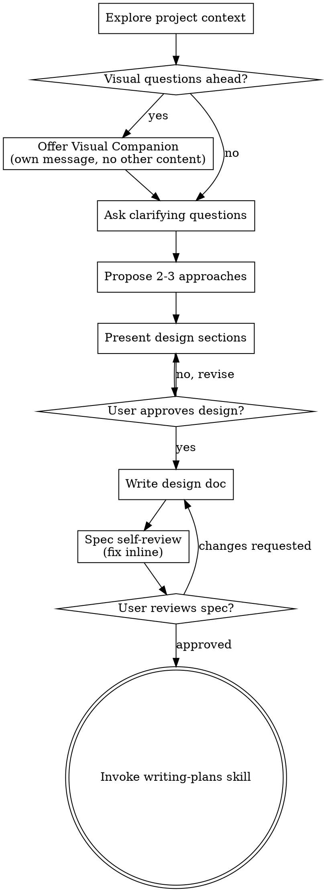

# 将想法变成设计

通过自然的协作对话，帮助将想法转化为完整的设计和规范。

首先理解当前的项目背景，然后逐个提问来细化想法。一旦你理解了要构建什么，呈现设计并获得用户批准。

<HARD-GATE>
在呈现设计并获得用户批准之前，不要调用任何实现技能、编写任何代码、搭建任何项目或采取任何实现行动。这适用于每个项目，无论其复杂程度如何。
</HARD-GATE>

## 反模式："这太简单了，不需要设计"

每个项目都要经历这个过程。一个待办事项列表、一个单函数实用程序、一个配置更改 - 它们都需要。"简单"的项目往往因为未经检查的假设而浪费最多工作。设计可以很短（真正简单的项目只需几句话），但你必须呈现它并获得批准。

## 检查清单

你必须为以下每一项创建一个任务，并按顺序完成它们：

1. **探索项目背景** - 检查文件、文档、最近的提交
2. **提供可视化伴侣** (如果主题涉及可视化问题) - 这是单独的消息，不与澄清问题合并。请参阅下面的"可视化伴侣"部分。
3. **提出澄清问题** - 逐个提出，了解目的、约束和成功标准
4. **提议2-3种方法** - 具有权衡和你的建议
5. **呈现设计** - 按其复杂性分为多个部分，在每个部分后获得用户批准
6. **编写设计文档** - 保存到 `docs/superpowers/specs/YYYY-MM-DD-<topic>-design.md` 并提交
7. **规范自评** - 快速内联检查占位符、矛盾、歧义、范围 (见下文)
8. **用户评审规范** - 在继续之前询问用户是否要评审规范文件
9. **过渡到实现** - 调用 writing-plans 技能来创建实现计划

## 过程流

**最终状态是调用 writing-plans。** 不要调用 frontend-design、mcp-builder 或任何其他实现技能。在 brainstorming 之后唯一调用的技能是 writing-plans。

## 过程

**理解想法：**

- 首先检查当前的项目状态（文件、文档、最近的提交）
- 在提出详细问题之前，评估范围：如果请求描述了多个独立的子系统（例如，"构建一个具有聊天、文件存储、账单和分析的平台"），立即标记这一点。不要浪费问题来细化一个需要先分解的项目的细节。
- 如果项目对于单个规范来说太大，帮助用户分解为子项目：有哪些独立的部分，它们如何相关，应该以什么顺序构建？然后通过正常的设计流程对第一个子项目进行头脑风暴。每个子项目都有自己的规范 → 计划 → 实现周期。
- 对于范围适当的项目，逐个提问来细化想法
- 尽可能偏好多选问题，但开放式也可以
- 每条消息只有一个问题 - 如果主题需要更多探索，将其分为多个问题
- 专注于理解：目的、约束、成功标准

**探索方法：**

- 提议2-3种不同的方法以及权衡
- 以对话的方式呈现选项，说明你的建议和推理
- 以推荐的选项开头，解释原因

**呈现设计：**

- 一旦你相信你理解了要构建什么，呈现设计
- 根据每个部分的复杂性进行调整：如果简单，则为几句话；如果细致入微，最多200-300个单词
- 在每个部分后询问是否看起来没问题
- 涵盖：架构、组件、数据流、错误处理、测试
- 如果什么地方不太对，要准备好回头澄清

**设计隔离和清晰性：**

- 将系统分解为较小的单元，每个单元都有一个清晰的目的，通过定义明确的接口进行通信，可以独立理解和测试
- 对于每个单元，你应该能够回答：它做什么，如何使用它，它依赖什么？
- 有人能在不阅读其内部的情况下理解单元的作用吗？不破坏使用者的情况下能改变内部吗？如果不能，边界需要改进。
- 更小、边界清晰的单元也更容易使用 - 当你可以一次性掌握的代码时，你能更好地推理；当文件专注时，你的编辑更可靠。当文件变大时，这通常表明它在做太多事情。

**在现有代码库中工作：**

- 在提出更改之前探索当前结构。遵循现有的模式。
- 如果现有代码有影响工作的问题（例如，一个已经变大的文件、不清晰的边界、纠缠的职责），将有针对性的改进作为设计的一部分 - 像一个好的开发者改进他们工作的代码的方式。
- 不要提议无关的重构。专注于对当前目标有帮助的东西。

## 设计之后

**文档编制：**

- 将验证的设计（规范）写入 `docs/superpowers/specs/YYYY-MM-DD-<topic>-design.md`
  - (用户对规范位置的偏好会覆盖此默认值)
- 如果可用，使用 elements-of-style:writing-clearly-and-concisely 技能
- 将设计文档提交到 git

**规范自评：**
编写规范文档后，以新的眼光审视它：

1. **占位符扫描：** 有任何 "TBD"、"TODO"、不完整的部分或模糊的需求吗？修复它们。
2. **内部一致性：** 有部分相互矛盾吗？架构与功能描述相符吗？
3. **范围检查：** 这是否专注于单个实现计划，还是需要分解？
4. **歧义检查：** 任何需求能以两种不同的方式理解吗？如果是，选择一个并使其明确。

内联修复任何问题。无需重新审查 - 只需修复并继续。

**用户审查门：**
在规范审查循环通过后，在继续之前要求用户审查写入的规范：

> "规范已编写并提交到 `<path>`。请审查它，如果你想在我们开始制定实现计划之前进行任何更改，请告诉我。"

等待用户的响应。如果他们要求更改，进行更改并重新运行规范审查循环。仅在用户批准后才继续。

**实现：**

- 调用 writing-plans 技能来创建详细的实现计划
- 不要调用任何其他技能。writing-plans 是下一步。

## 关键原则

- **一次一个问题** - 不要用多个问题让人不知所措
- **多选优先** - 比开放式问题更容易回答
- **无情地应用 你都不会需要它(YAGNI)** - 从所有设计中删除不必要的功能
- **探索替代方案** - 在确定之前始终提议2-3种方法
- **增量验证** - 呈现设计，在继续之前获得批准
- **保持灵活** - 当某些地方不太对时，回头澄清

## 可视化伴侣

一个基于浏览器的伴侣，用于在头脑风暴期间展示模型、图表和视觉选项。作为工具可用 - 不是模式。接受伴侣意味着它对受益于视觉处理的问题可用；它不意味着每个问题都通过浏览器。

**提供伴侣：** 当你预测即将进行的问题会涉及视觉内容（模型、布局、图表）时，提供一次以获得同意：
> "我们正在开发的某些内容如果我能在网络浏览器中向你展示可能会更容易解释。我可以在进行过程中组合模型、图表、比较和其他视觉效果。这个功能是新的，可能会大量消耗令牌。想试试吗？(需要打开本地 URL)"

**此提议必须是其自己的消息。** 不要将其与澄清问题、上下文摘要或任何其他内容合并。消息应该仅包含上述提议，其他什么都不要。在继续之前等待用户的响应。如果他们拒绝，继续纯文本头脑风暴。

**逐个问题决策：** 即使用户同意后，也要为每个问题决定是否使用浏览器或终端。测试：**用户通过看到它会比读到它更理解吗？**

- **使用浏览器** 用于视觉内容 - 模型、线框、布局比较、架构图、并排视觉设计
- **使用终端** 用于文本内容 - 需求问题、概念选择、权衡列表、A/B/C/D 文本选项、范围决策

关于用户界面主题的问题不是自动的视觉问题。"在这个背景下个性意味着什么？" 是一个概念问题 - 使用终端。"哪个向导布局效果更好？" 是一个视觉问题 - 使用浏览器。

如果他们同意伴侣，在继续之前阅读详细指南：
`skills/brainstorming/visual-companion.md`
