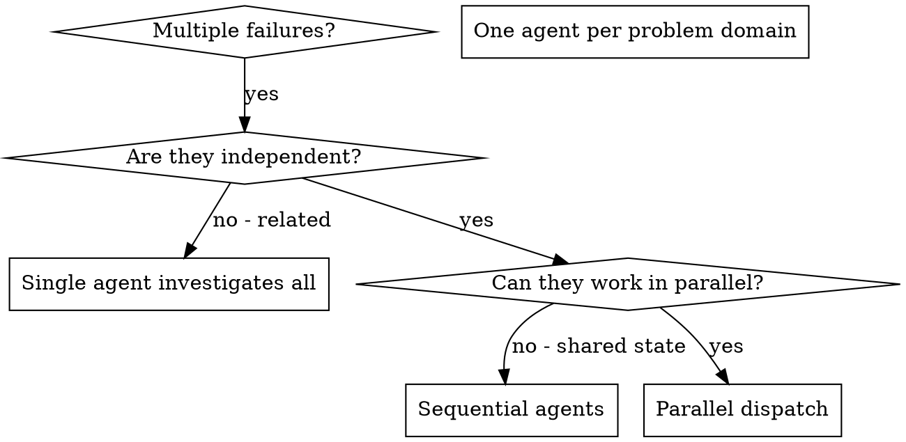

# 分派并行代理

## 概述

您将任务委派给具有隔离上下文的专门代理。通过精确制定他们的指令和上下文，您可以确保他们专注于任务并取得成功。他们绝不应该继承您会话的上下文或历史记录——您需要精确构造他们所需的内容。这也为您自己的协调工作保留了上下文。

当您有多个不相关的故障时（不同的测试文件、不同的子系统、不同的错误），按顺序调查他们会浪费时间。每次调查都是独立的，可以并行进行。

**核心原则：** 为每个独立的问题域分派一个代理。让他们并发工作。

## 何时使用



**使用场景：**
- 3个或更多测试文件失败，根本原因不同
- 多个子系统独立损坏
- 可以在不了解其他问题上下文的情况下理解每个问题
- 调查之间没有共享状态

**不要在以下情况下使用：**
- 故障相关（修复一个可能会修复其他）
- 需要理解完整的系统状态
- 代理会相互干扰

## 模式

### 1. 识别独立域

按损坏的内容对故障进行分组：
- 文件 A 测试：工具批准流程
- 文件 B 测试：批量完成行为
- 文件 C 测试：中止功能

每个域都是独立的——修复工具批准不会影响中止测试。

### 2. 创建专注的代理任务

每个代理获得：
- **具体范围：** 一个测试文件或子系统
- **明确目标：** 使这些测试通过
- **约束条件：** 不要更改其他代码
- **预期输出：** 您发现和修复的内容的摘要

### 3. 并行分派

```typescript
// In Claude Code / AI environment
Task("Fix agent-tool-abort.test.ts failures")
Task("Fix batch-completion-behavior.test.ts failures")
Task("Fix tool-approval-race-conditions.test.ts failures")
// All three run concurrently
```

### 4. 审查和集成

当代理返回时：
- 读取每个摘要
- 验证修复没有冲突
- 运行完整的测试套件
- 集成所有更改

## 代理提示结构

好的代理提示具有以下特点：
1. **专注** - 一个明确的问题域
2. **独立** - 理解问题所需的所有上下文
3. **明确输出** - 代理应该返回什么？

```markdown
Fix the 3 failing tests in src/agents/agent-tool-abort.test.ts:

1. "should abort tool with partial output capture" - expects 'interrupted at' in message
2. "should handle mixed completed and aborted tools" - fast tool aborted instead of completed
3. "should properly track pendingToolCount" - expects 3 results but gets 0

These are timing/race condition issues. Your task:

1. Read the test file and understand what each test verifies
2. Identify root cause - timing issues or actual bugs?
3. Fix by:
   - Replacing arbitrary timeouts with event-based waiting
   - Fixing bugs in abort implementation if found
   - Adjusting test expectations if testing changed behavior

Do NOT just increase timeouts - find the real issue.

Return: Summary of what you found and what you fixed.
```

## 常见错误

**❌ 太宽泛：**"修复所有测试" - 代理会迷失
**✅ 明确：**"修复 agent-tool-abort.test.ts" - 专注范围

**❌ 没有上下文：**"修复竞态条件" - 代理不知道在哪里
**✅ 上下文：** 粘贴错误消息和测试名称

**❌ 无约束：** 代理可能会重构所有内容
**✅ 约束：**"不要更改生产代码"或"仅修复测试"

**❌ 模糊输出：**"修复它" - 你不知道什么改变了
**✅ 明确：**"返回根本原因和更改的摘要"

## 何时不使用

**相关故障：** 修复一个可能会修复其他——首先一起调查
**需要完整上下文：** 理解需要查看整个系统
**探索式调试：** 你不知道什么坏了
**共享状态：** 代理会相互干扰（编辑相同文件、使用相同资源）

## 会话中的真实示例

**场景：** 主要重构后 3 个文件中出现 6 个测试失败

**故障：**
- agent-tool-abort.test.ts：3 个故障（时序问题）
- batch-completion-behavior.test.ts：2 个故障（工具未执行）
- tool-approval-race-conditions.test.ts：1 个故障（执行计数 = 0）

**决定：** 独立域——中止逻辑与批量完成逻辑与竞态条件分离

**分派：**
```
Agent 1 → Fix agent-tool-abort.test.ts
Agent 2 → Fix batch-completion-behavior.test.ts
Agent 3 → Fix tool-approval-race-conditions.test.ts
```

**结果：**
- 代理 1：用基于事件的等待替换超时
- 代理 2：修复了事件结构错误（threadId 位置错误）
- 代理 3：添加了等待异步工具执行完成的功能

**集成：** 所有修复独立，无冲突，完整套件通过

**节省的时间：** 3 个问题并行解决 vs 顺序解决

## 关键优势

1. **并行化** - 多个调查同时进行
2. **专注** - 每个代理范围狭窄，上下文跟踪减少
3. **独立性** - 代理不会相互干扰
4. **速度** - 3 个问题在 1 个问题的时间内解决

## 验证

代理返回后：
1. **审查每个摘要** - 理解更改的内容
2. **检查冲突** - 代理是否编辑了相同的代码？
3. **运行完整套件** - 验证所有修复一起工作
4. **现场检查** - 代理可能会犯系统性错误

## 真实影响

来自调试会话（2025-10-03）：
- 3 个文件中的 6 个故障
- 3 个代理并行分派
- 所有调查并发完成
- 所有修复成功集成
- 代理更改之间零冲突
