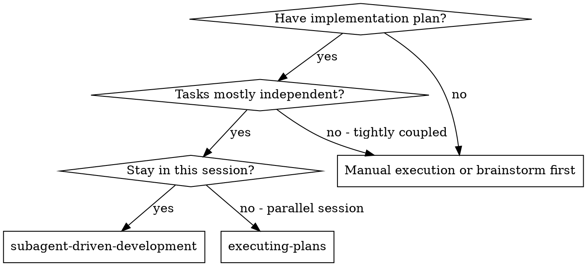
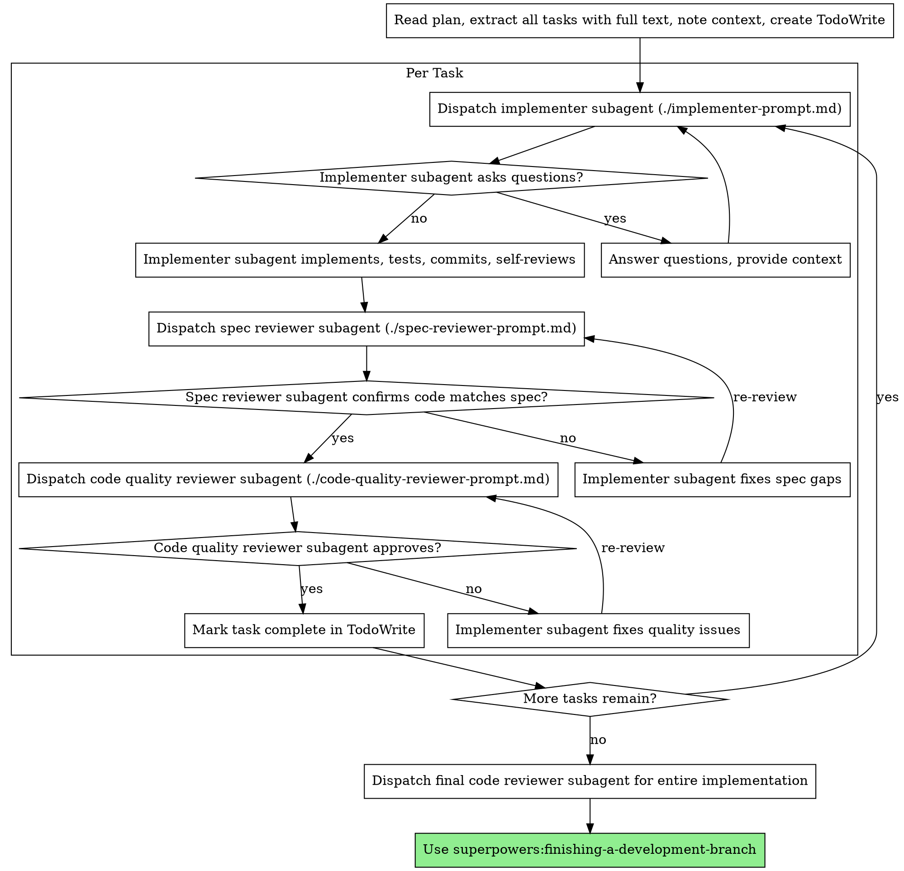

# 子代理驱动开发(Subagent-Driven Development)

每个任务派遣新鲜子代理执行，每个任务后进行两阶段审查：首先进行规范合规审查，然后进行代码质量审查。

**为什么使用子代理(subagent)：** 你将任务委派给具有隔离上下文的专业代理(agent)。通过精心设计他们的指令和上下文，确保他们保持专注并成功完成任务。他们不应该继承你的会话上下文或历史记录——你需要精确地构造他们需要的内容。这也为你的协调工作保留了上下文。

**核心原则：** 每个任务的新鲜子代理 + 两阶段审查(规范合规后代码质量) = 高质量、快速迭代

## 何时使用



**对比执行计划(并行会话)：**
- 相同会话(无上下文切换)
- 每个任务的新鲜子代理(无上下文污染)
- 每个任务后两阶段审查：首先规范合规，然后代码质量
- 更快的迭代(任务之间无人工介入)

## 过程



## 模型选择

使用能处理每个角色的最弱模型以节省成本并提高速度。

**机械实现任务**(隔离函数、清晰规范、1-2个文件且行数较短)：使用快速、廉价的模型。当计划规范良好时，大多数实现任务都是机械性的。

**集成和判断任务**(多文件协调、模式匹配、调试)：使用标准模型。

**架构、设计和审查任务**：使用最强大的可用模型。

**任务复杂度信号：**
- 触及1-2个文件(行数较短)且规范完整 → 廉价模型
- 触及多个文件且存在集成关切 → 标准模型
- 需要设计判断或广泛的代码库理解 → 最强大的模型

## 处理实现者状态

实现者子代理报告四种状态之一。适当处理每一种：

**DONE：** 继续进行规范合规审查。

**DONE_WITH_CONCERNS：** 实现者完成了工作但标记了疑虑。阅读疑虑后再继续。如果疑虑涉及正确性或范围，在审查前处理。如果是观察(例如"这个文件变得太大了")，记下并继续审查。

**NEEDS_CONTEXT：** 实现者需要未提供的信息。提供缺失的上下文并重新派遣。

**BLOCKED：** 实现者无法完成任务。评估阻碍：
1. 如果是上下文问题，提供更多上下文并用相同模型重新派遣
2. 如果任务需要更多推理，用更强大的模型重新派遣
3. 如果任务太大，将其分成更小的部分
4. 如果计划本身错误，上报给用户

**永远不要** 忽略上报或强制相同模型在没有改变的情况下重试。如果实现者说卡住了，必须有什么改变。

## 提示模板

- `./implementer-prompt.md` - 派遣实现者子代理
- `./spec-reviewer-prompt.md` - 派遣规范合规审查者子代理
- `./code-quality-reviewer-prompt.md` - 派遣代码质量审查者子代理

## 示例工作流

```
You: I'm using Subagent-Driven Development to execute this plan.

[Read plan file once: docs/superpowers/plans/feature-plan.md]
[Extract all 5 tasks with full text and context]
[Create TodoWrite with all tasks]

Task 1: Hook installation script

[Get Task 1 text and context (already extracted)]
[Dispatch implementation subagent with full task text + context]

Implementer: "Before I begin - should the hook be installed at user or system level?"

You: "User level (~/.config/superpowers/hooks/)"

Implementer: "Got it. Implementing now..."
[Later] Implementer:
  - Implemented install-hook command
  - Added tests, 5/5 passing
  - Self-review: Found I missed --force flag, added it
  - Committed

[Dispatch spec compliance reviewer]
Spec reviewer: ✅ Spec compliant - all requirements met, nothing extra

[Get git SHAs, dispatch code quality reviewer]
Code reviewer: Strengths: Good test coverage, clean. Issues: None. Approved.

[Mark Task 1 complete]

Task 2: Recovery modes

[Get Task 2 text and context (already extracted)]
[Dispatch implementation subagent with full task text + context]

Implementer: [No questions, proceeds]
Implementer:
  - Added verify/repair modes
  - 8/8 tests passing
  - Self-review: All good
  - Committed

[Dispatch spec compliance reviewer]
Spec reviewer: ❌ Issues:
  - Missing: Progress reporting (spec says "report every 100 items")
  - Extra: Added --json flag (not requested)

[Implementer fixes issues]
Implementer: Removed --json flag, added progress reporting

[Spec reviewer reviews again]
Spec reviewer: ✅ Spec compliant now

[Dispatch code quality reviewer]
Code reviewer: Strengths: Solid. Issues (Important): Magic number (100)

[Implementer fixes]
Implementer: Extracted PROGRESS_INTERVAL constant

[Code reviewer reviews again]
Code reviewer: ✅ Approved

[Mark Task 2 complete]

...

[After all tasks]
[Dispatch final code-reviewer]
Final reviewer: All requirements met, ready to merge

Done!
```

## 优势

**对比手动执行：**
- 子代理自然遵循测试驱动开发(TDD)
- 每个任务的新鲜上下文(无混淆)
- 并行安全(子代理不相互干扰)
- 子代理可以提问(工作前和期间)

**对比执行计划：**
- 相同会话(无交接)
- 连续进展(无等待)
- 审查检查点自动化

**效率收益：**
- 无文件读取开销(控制器提供完整文本)
- 控制器策划完全需要的上下文
- 子代理提前获得完整信息
- 问题在工作开始前浮出(不是之后)

**质量关口：**
- 自审查在交接前发现问题
- 两阶段审查：规范合规，然后代码质量
- 审查循环确保修复真正有效
- 规范合规防止过度/不足构建
- 代码质量确保实现构建良好

**成本：**
- 更多子代理调用(每个任务实现者 + 2个审查者)
- 控制器做更多准备工作(提前提取所有任务)
- 审查循环增加迭代
- 但早期发现问题(比后来调试便宜)

## 红旗

**永远不要：**
- 在main/master分支上启动实现，不经用户明确同意
- 跳过审查(规范合规或代码质量)
- 继续进行未修复的问题
- 并行派遣多个实现子代理(冲突)
- 让子代理读计划文件(改为提供完整文本)
- 跳过场景设置上下文(子代理需要理解任务的位置)
- 忽视子代理问题(回答后再让他们继续)
- 接受规范合规上的"足够接近"(规范审查者发现问题 = 未完成)
- 跳过审查循环(审查者发现问题 = 实现者修复 = 再次审查)
- 让实现者自审查替代实际审查(两者都需要)
- **在规范合规✅之前启动代码质量审查**(顺序错误)
- 在任一审查有未解决的问题时移动到下一任务

**如果子代理提出问题：**
- 清楚、完整地回答
- 必要时提供额外上下文
- 不要仓促他们进入实现

**如果审查者发现问题：**
- 实现者(相同子代理)修复问题
- 审查者再次审查
- 重复直到批准
- 不要跳过再次审查

**如果子代理任务失败：**
- 派遣修复子代理并给出具体指令
- 不要尝试手动修复(上下文污染)

## 集成

**必需工作流技能：**
- **superpowers:using-git-worktrees** - 必需：启动前设置隔离工作区
- **superpowers:writing-plans** - 创建此技能执行的计划
- **superpowers:requesting-code-review** - 审查者子代理的代码审查模板
- **superpowers:finishing-a-development-branch** - 所有任务后完成开发

**子代理应使用：**
- **superpowers:test-driven-development** - 子代理对每个任务遵循测试驱动开发

**备选工作流：**
- **superpowers:executing-plans** - 使用并行会话而不是相同会话执行
