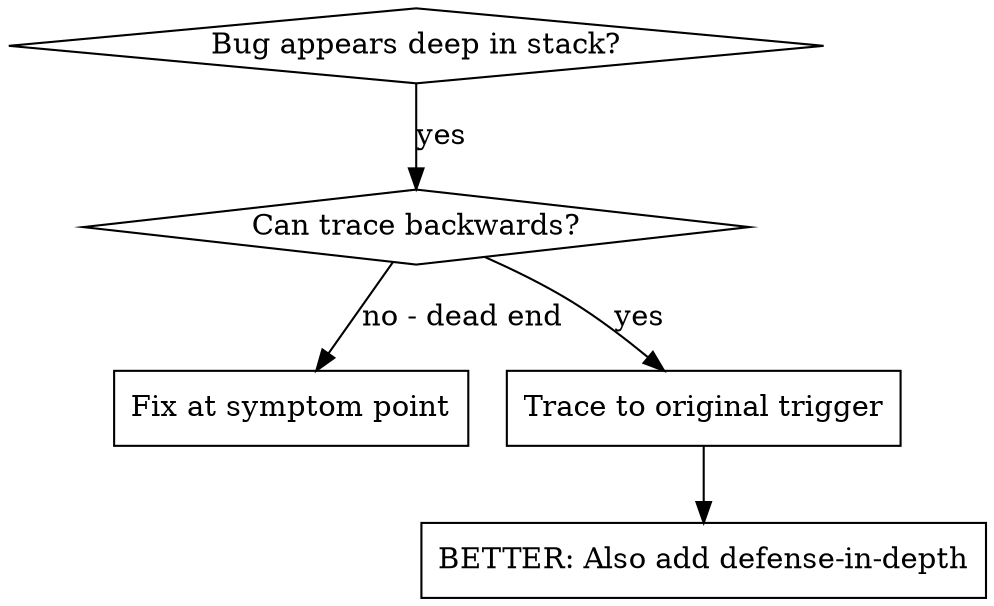
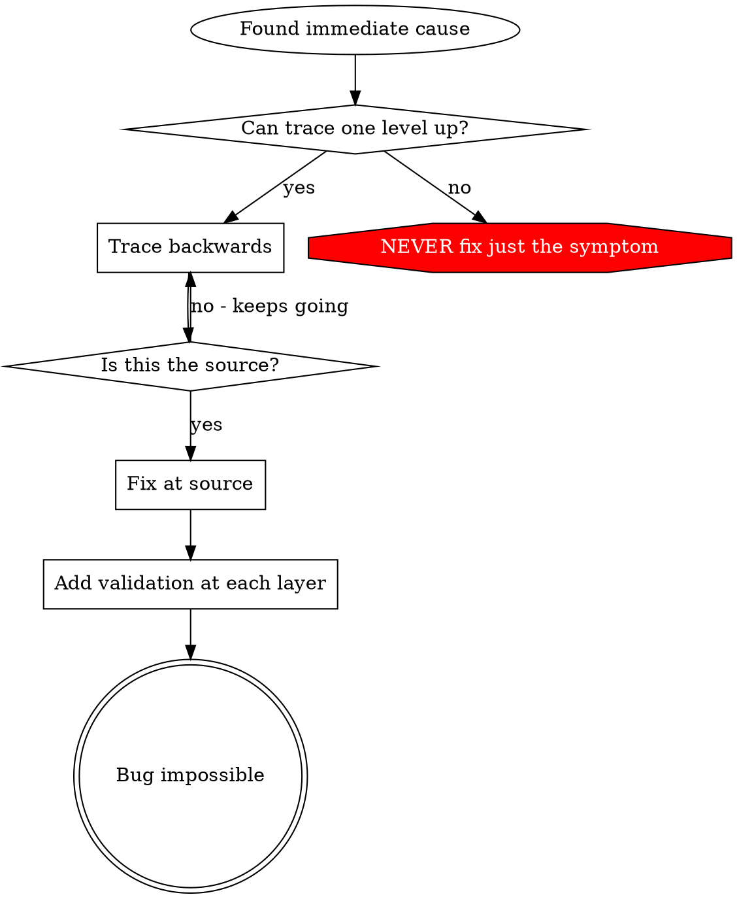

# 根本原因追踪

## 概述

错误常常在调用栈的深处出现(在错误的目录中初始化 git，在错误的位置创建文件，用错误的路径打开数据库)。本能反应是修复错误出现的地方，但这只是在治疗症状。

**核心原则:** 沿着调用链向后追踪，直到找到原始触发点，然后在源头修复。

## 使用时机



**在以下情况下使用：**
- 错误发生在执行的深处(不在入口点)
- 堆栈跟踪显示长调用链
- 不清楚无效数据来自何处
- 需要找到哪个测试/代码触发了问题

## 追踪流程

### 1. 观察症状
```
Error: git init failed in /Users/jesse/project/packages/core
```

### 2. 找出直接原因
**什么代码直接导致了这个问题?**
```typescript
await execFileAsync('git', ['init'], { cwd: projectDir });
```

### 3. 追问：谁调用了这个?
```typescript
WorktreeManager.createSessionWorktree(projectDir, sessionId)
  → called by Session.initializeWorkspace()
  → called by Session.create()
  → called by test at Project.create()
```

### 4. 继续向上追踪
**传递了什么值?**
- `projectDir = ''` (空字符串!)
- 空字符串作为 `cwd` 解析为 `process.cwd()`
- 那就是源代码目录!

### 5. 找到原始触发点
**空字符串从哪里来的?**
```typescript
const context = setupCoreTest(); // Returns { tempDir: '' }
Project.create('name', context.tempDir); // Accessed before beforeEach!
```

## 添加堆栈跟踪

当无法手动追踪时，添加工具代码：

```typescript
// Before the problematic operation
async function gitInit(directory: string) {
  const stack = new Error().stack;
  console.error('DEBUG git init:', {
    directory,
    cwd: process.cwd(),
    nodeEnv: process.env.NODE_ENV,
    stack,
  });

  await execFileAsync('git', ['init'], { cwd: directory });
}
```

**关键点：** 在测试中使用 `console.error()`(不是 logger - 可能不会显示)

**运行并捕获：**
```bash
npm test 2>&1 | grep 'DEBUG git init'
```

**分析堆栈跟踪：**
- 查找测试文件名
- 找到触发调用的行号
- 识别模式(同一个测试? 同一个参数?)

## 找出导致污染的测试

如果某个东西在测试期间出现但你不知道是哪个测试：

使用此目录中的二分搜索脚本 `find-polluter.sh`：

```bash
./find-polluter.sh '.git' 'src/**/*.test.ts'
```

逐个运行测试，在第一个污染源处停止。详见脚本使用说明。

## 实际案例：空的 projectDir

**症状：** `.git` 在 `packages/core/`(源代码)中创建

**追踪链：**
1. `git init` 在 `process.cwd()`中运行 ← 空 cwd 参数
2. WorktreeManager 被调用时传入空的 projectDir
3. Session.create() 传递了空字符串
4. 测试在 beforeEach 前访问了 `context.tempDir`
5. setupCoreTest() 初始时返回 `{ tempDir: '' }`

**根本原因：** 顶层变量初始化访问了空值

**修复：** 将 tempDir 设为 getter，在 beforeEach 之前访问时抛出异常

**同时添加了深度防御：**
- 第 1 层：Project.create() 验证目录
- 第 2 层：WorkspaceManager 验证不为空
- 第 3 层：NODE_ENV 守卫拒绝在 tmpdir 外初始化 git
- 第 4 层：在 git init 前记录堆栈跟踪

## 关键原则



**千万不要只在错误出现的地方进行修复。** 向后追踪找到原始触发点。

## 堆栈跟踪技巧

**在测试中：** 使用 `console.error()`，不是 logger - logger 可能被抑制
**在操作前：** 在危险操作前记录，不是在失败后
**包含上下文：** 目录、cwd、环境变量、时间戳
**捕获堆栈：** `new Error().stack` 显示完整调用链

## 现实影响

来自调试会话(2025-10-03)：
- 通过 5 级追踪找到根本原因
- 在源头修复(getter 验证)
- 添加了 4 层防御
- 1847 个测试通过，零污染
