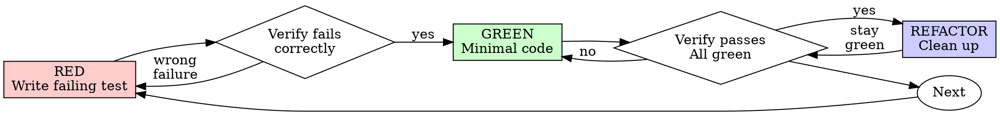

# 测试驱动开发(TDD)

## 概述

先编写测试。观察它失败。编写最少的代码使其通过。

**核心原则：** 如果你没有看着测试失败，你就不知道它是否测试了正确的东西。

**违反规则的字面意思就是违反规则的精神。**

## 何时使用

**总是：**
- 新功能
- 修复错误
- 重构
- 行为改变

**例外（询问你的人类搭档）：**
- 一次性原型
- 生成的代码
- 配置文件

想要"仅这一次跳过TDD"？停下来。那是自欺欺人。

## 铁律

```
没有失败的测试就没有生产代码
```

在测试之前写代码？删除它。重新开始。

**没有例外：**
- 不要作为"参考"保留
- 写测试时不要"调整"它
- 不要看它
- 删除意味着删除

从测试开始重新实现。就这样。

## 红-绿-重构



### RED - 编写失败的测试

编写一个展示应该发生什么的最小测试。

\<Good>
```typescript
test('retries failed operations 3 times', async () => {
  let attempts = 0;
  const operation = () => {
    attempts++;
    if (attempts < 3) throw new Error('fail');
    return 'success';
  };

  const result = await retryOperation(operation);

  expect(result).toBe('success');
  expect(attempts).toBe(3);
});
```
清晰的名字，测试真实行为，一件事
\</Good>

\<Bad>
```typescript
test('retry works', async () => {
  const mock = jest.fn()
    .mockRejectedValueOnce(new Error())
    .mockRejectedValueOnce(new Error())
    .mockResolvedValueOnce('success');
  await retryOperation(mock);
  expect(mock).toHaveBeenCalledTimes(3);
});
```
名字模糊，测试的是模拟而不是代码
\</Bad>

**要求：**
- 一个行为
- 清晰的名字
- 真实代码（尽可能不使用模拟）

### 验证RED - 观察它失败

**必须。永不跳过。**

```bash
npm test path/to/test.test.ts
```

确认：
- 测试失败（不是报错）
- 失败消息是预期的
- 失败是因为功能缺失（不是打字错误）

**测试通过？** 你在测试已存在的行为。修复测试。

**测试报错？** 修复错误，重新运行直到它正确失败。

### GREEN - 最少代码

编写最简单的代码来通过测试。

\<Good>
```typescript
async function retryOperation<T>(fn: () => Promise<T>): Promise<T> {
  for (let i = 0; i < 3; i++) {
    try {
      return await fn();
    } catch (e) {
      if (i === 2) throw e;
    }
  }
  throw new Error('unreachable');
}
```
仅够通过
\</Good>

\<Bad>
```typescript
async function retryOperation<T>(
  fn: () => Promise<T>,
  options?: {
    maxRetries?: number;
    backoff?: 'linear' | 'exponential';
    onRetry?: (attempt: number) => void;
  }
): Promise<T> {
  // YAGNI
}
```
过度设计
\</Bad>

不要添加功能、重构其他代码或"改进"超出测试的范围。

### 验证GREEN - 观察它通过

**必须。**

```bash
npm test path/to/test.test.ts
```

确认：
- 测试通过
- 其他测试仍然通过
- 输出干净（没有错误、警告）

**测试失败？** 修复代码，不是测试。

**其他测试失败？** 现在修复。

### REFACTOR - 清理

在绿色之后：
- 移除重复
- 改进名字
- 提取帮助函数

保持测试绿色。不要添加行为。

### 重复

下一个失败的测试，下一个功能。

## 好的测试

| 质量 | 好 | 坏 |
|------|-----|-----|
| **最少** | 一件事。名字中有"and"？分割它。 | `test('validates email and domain and whitespace')` |
| **清晰** | 名字描述行为 | `test('test1')` |
| **展示意图** | 演示所需API | 掩盖代码应该做什么 |

## 为什么顺序很重要

**"我之后再写测试来验证它工作"**

在代码之后写的测试立即通过。立即通过证明不了什么：
- 可能测试了错误的东西
- 可能测试实现，不是行为
- 可能遗漏了你忘记的边界情况
- 你从未看到它捕获错误

测试优先强制你看到测试失败，证明它实际上测试了什么。

**"我已经手动测试了所有边界情况"**

手动测试是临时的。你认为你测试了一切，但：
- 没有记录你测试了什么
- 代码改变时无法重新运行
- 在压力下容易忘记情况
- "我试过时它工作了"≠ 全面

自动化测试是系统化的。它们每次都以同样的方式运行。

**"删除X小时的工作是浪费"**

沉没成本谬误。时间已经过去了。你现在的选择：
- 删除并用TDD重写（X小时，高信心）
- 保留它并之后添加测试（30分钟，低信心，可能有错误）

"浪费"是保留你不能信任的代码。没有真实测试的工作代码是技术债。

**"TDD是教条，务实意味着适应"**

TDD是务实的：
- 在提交前发现错误（比之后调试更快）
- 防止回归（测试立即捕获中断）
- 记录行为（测试显示如何使用代码）
- 启用重构（自由改变，测试捕获中断）

"务实"的捷径 = 生产中调试 = 更慢。

**"之后的测试达到相同目标 - 这是精神不是仪式"**

不。之后的测试回答"这是什么？" 优先的测试回答"这应该是什么？"

之后的测试被你的实现所偏见。你测试你构建的东西，不是所需的东西。你验证记住的边界情况，不是发现的。

优先测试强制在实现之前发现边界情况。之后的测试验证你记住了一切（你没有）。

30分钟之后的测试≠ TDD。你得到覆盖，失去测试工作的证明。

## 常见的自欺欺人

| 借口 | 现实 |
|------|------|
| "太简单了不需要测试" | 简单的代码会中断。测试花费30秒。 |
| "我之后会测试" | 立即通过的测试证明不了什么。 |
| "之后的测试达到相同目标" | 之后的测试 = "这是什么？" 优先的 = "这应该是什么？" |
| "已经手动测试过" | 临时的≠ 系统化。无记录，无法重新运行。 |
| "删除X小时是浪费" | 沉没成本谬误。保留未验证的代码是技术债。 |
| "作为参考保留，先写测试" | 你会适应它。那是之后的测试。删除意味着删除。 |
| "需要先探索" | 好的。扔掉探索，从TDD开始。 |
| "测试困难 = 设计不清楚" | 听测试。难以测试 = 难以使用。 |
| "TDD会减慢我的速度" | TDD比调试快。务实 = 测试优先。 |
| "手动测试更快" | 手动不能证明边界情况。你会重新测试每次改变。 |
| "现有代码没有测试" | 你在改进它。为现有代码添加测试。 |

## 红旗 - 停下来重新开始

- 测试前的代码
- 实现后的测试
- 测试立即通过
- 无法解释为什么测试失败
- "之后"添加的测试
- 合理化"仅这一次"
- "我已经手动测试过"
- "之后的测试达到相同目的"
- "这是关于精神不是仪式"
- "作为参考保留"或"适应现有代码"
- "已经花了X小时，删除是浪费"
- "TDD是教条，我在务实"
- "这是不同的因为..."

**所有这些都意味着：删除代码。从TDD重新开始。**

## 例子：修复错误

**错误：** 接受空电子邮件

**RED**
```typescript
test('rejects empty email', async () => {
  const result = await submitForm({ email: '' });
  expect(result.error).toBe('Email required');
});
```

**验证RED**
```bash
$ npm test
FAIL: expected 'Email required', got undefined
```

**GREEN**
```typescript
function submitForm(data: FormData) {
  if (!data.email?.trim()) {
    return { error: 'Email required' };
  }
  // ...
}
```

**验证GREEN**
```bash
$ npm test
PASS
```

**REFACTOR**
如果需要，为多个字段提取验证。

## 验证清单

在标记工作完成前：

- [ ] 每个新函数/方法都有测试
- [ ] 看着每个测试失败后才实现
- [ ] 每个测试失败是因为预期的原因（功能缺失，不是打字错误）
- [ ] 为每个测试编写了最少代码
- [ ] 所有测试通过
- [ ] 输出干净（无错误、警告）
- [ ] 测试使用真实代码（仅在无法避免时使用模拟）
- [ ] 覆盖了边界情况和错误

无法选中所有框？你跳过了TDD。重新开始。

## 当卡住时

| 问题 | 解决方案 |
|------|---------|
| 不知道如何测试 | 编写期望的API。首先写断言。询问你的人类搭档。 |
| 测试太复杂 | 设计太复杂。简化接口。 |
| 必须模拟一切 | 代码耦合太紧。使用依赖注入。 |
| 测试设置巨大 | 提取帮助函数。仍然复杂？简化设计。 |

## 调试集成

发现错误？编写失败的测试重现它。遵循TDD循环。测试证明修复并防止回归。

永远不要在没有测试的情况下修复错误。

## 测试反模式

添加模拟或测试实用程序时，阅读@testing-anti-patterns.md以避免常见陷阱：
- 测试模拟行为而不是真实行为
- 向生产类添加仅测试方法
- 在不理解依赖的情况下嘲笑

## 最终规则

```
生产代码 → 测试存在且首先失败
否则 → 不是TDD
```

没有你的人类搭档的许可，没有例外。
