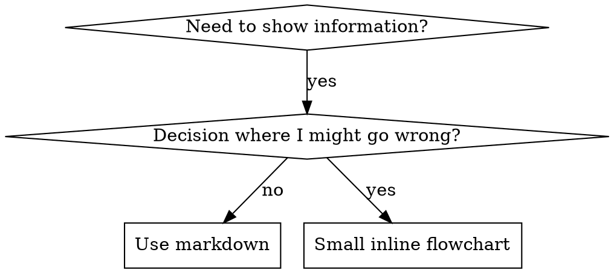

# 编写技能

## 概述

**编写技能是将测试驱动开发(TDD)应用于流程文档的过程。**

**个人技能存储在代理特定的目录中(Claude Code 的 `~/.claude/skills`，Codex 的 `~/.agents/skills/`)**

你编写测试用例(带有子代理(subagent)的压力场景)，观察它们失败(基准行为)，编写技能(文档)，观察测试通过(代理遵守)，然后重构(堵住漏洞)。

**核心原则：**如果你没有看到代理在没有技能的情况下失败，你就不知道该技能是否教授了正确的内容。

**必需背景：**使用此技能之前，您必须理解 superpowers:test-driven-development。该技能定义了基础的 RED-GREEN-REFACTOR 循环。本技能将 TDD 应用于文档。

**官方指导：**有关 Anthropic 的官方技能创作最佳实践，请参阅 anthropic-best-practices.md。本文档提供了补充此技能中 TDD 重点方法的额外模式和指南。

## 什么是技能？

**技能**是经验证的技术、模式或工具的参考指南。技能帮助未来的 Claude 实例找到和应用有效的方法。

**技能是：**可重复使用的技术、模式、工具、参考指南

**技能不是：**关于你如何解决某个问题一次的叙述

## 技能创建的 TDD 映射

| TDD 概念 | 技能创建 |
|-------------|----------------|
| **测试用例** | 带有子代理(subagent)的压力场景 |
| **生产代码** | 技能文档(SKILL.md) |
| **测试失败(RED)** | 没有技能时代理违反规则(基准) |
| **测试通过(GREEN)** | 有技能时代理遵守规则 |
| **重构** | 堵住漏洞同时保持遵守 |
| **先写测试** | 在编写技能之前运行基准场景 |
| **观察失败** | 记录代理的确切理由 |
| **最小代码** | 编写针对这些具体违反行为的技能 |
| **观察通过** | 验证代理现在遵守 |
| **重构循环** | 找到新的理由→插入→重新验证 |

整个技能创建过程遵循 RED-GREEN-REFACTOR。

## 何时创建技能

**创建条件：**
- 该技术对你来说并不直观明显
- 你会在多个项目中参考这个
- 模式广泛适用(不是项目特定的)
- 其他人会受益

**不要为以下创建：**
- 一次性解决方案
- 其他地方文档齐全的标准实践
- 项目特定的约定(放在 CLAUDE.md 中)
- 机械约束(如果可以用正则表达式/验证强制执行，将其自动化——保存文档用于判断调用)

## 技能类型

### 技术
具有要遵循的步骤的具体方法(基于条件的等待(condition-based-waiting)、根因追踪(root-cause-tracing))

### 模式
解决问题的思考方式(使用标志展平(flatten-with-flags)、测试不变量(test-invariants))

### 参考
API 文档、语法指南、工具文档(Office 文档)

## 目录结构

```
skills/
  skill-name/
    SKILL.md              # 主要参考(必需)
    supporting-file.*     # 仅在需要时
```

**平面命名空间** - 所有技能都在一个可搜索的命名空间中

**单独文件用于：**
1. **大量参考**(100+ 行) - API 文档、综合语法
2. **可重用工具** - 脚本、实用程序、模板

**保持内联：**
- 原则和概念
- 代码模式(< 50 行)
- 其他所有内容

## SKILL.md 结构

**前置元数据(frontmatter)(YAML)：**
- 两个必需字段：`name` 和 `description`(查看 [agentskills.io/specification](https://agentskills.io/specification) 了解所有支持的字段)
- 最多 1024 字符总数
- `name`：仅使用字母、数字和连字符(无括号、特殊字符)
- `description`：第三人称，仅描述何时使用(不是它做什么)
  - 以"使用时..."开头以专注于触发条件
  - 包括具体的症状、情况和背景
  - **永远不要总结技能的流程或工作流**(看 CSO 部分了解原因)
  - 尽可能保持在 500 字符以下

```markdown
---
name: Skill-Name-With-Hyphens
description: Use when [specific triggering conditions and symptoms]
---

# Skill Name

## Overview
What is this? Core principle in 1-2 sentences.

## When to Use
[Small inline flowchart IF decision non-obvious]

Bullet list with SYMPTOMS and use cases
When NOT to use

## Core Pattern (for techniques/patterns)
Before/after code comparison

## Quick Reference
Table or bullets for scanning common operations

## Implementation
Inline code for simple patterns
Link to file for heavy reference or reusable tools

## Common Mistakes
What goes wrong + fixes

## Real-World Impact (optional)
Concrete results
```

## Claude 搜索优化(CSO)

**对发现很重要：**未来的 Claude 需要找到你的技能

### 1. 丰富的描述字段

**目的：**Claude 读取描述以决定为给定任务加载哪些技能。让它回答："我现在应该阅读这个技能吗？"

**格式：**以"使用时..."开头以专注于触发条件

**关键：描述 = 何时使用，不是技能做什么**

描述应该仅描述触发条件。不要在描述中总结技能的流程或工作流。

**为什么这很重要：**测试表明，当描述总结技能的工作流时，Claude 可能会遵循描述而不是阅读完整的技能内容。一个说"任务之间的代码审查"的描述导致 Claude 做一次审查，即使技能的流程图清楚地显示了两次审查(规范符合性然后代码质量)。

当描述改为"在执行具有独立任务的实现计划时使用"(没有工作流总结)时，Claude 正确地阅读了流程图并遵循了两阶段审查流程。

**陷阱：**总结工作流的描述会创建一个 Claude 会采取的快捷方式。技能体会成为 Claude 跳过的文档。

```yaml
# ❌ BAD: Summarizes workflow - Claude may follow this instead of reading skill
description: Use when executing plans - dispatches subagent per task with code review between tasks

# ❌ BAD: Too much process detail
description: Use for TDD - write test first, watch it fail, write minimal code, refactor

# ✅ GOOD: Just triggering conditions, no workflow summary
description: Use when executing implementation plans with independent tasks in the current session

# ✅ GOOD: Triggering conditions only
description: Use when implementing any feature or bugfix, before writing implementation code
```

**内容：**
- 使用具体的触发条件、症状和信号该技能适用的情况
- 描述*问题*(竞态条件、不一致的行为)而不是*特定语言的症状*(setTimeout、sleep)
- 保持触发条件与技术无关，除非技能本身是特定技术的
- 如果技能是特定技术的，在触发器中明确说明
- 以第三人称书写(注入到系统提示)
- **永远不要总结技能的流程或工作流**

```yaml
# ❌ BAD: Too abstract, vague, doesn't include when to use
description: For async testing

# ❌ BAD: First person
description: I can help you with async tests when they're flaky

# ❌ BAD: Mentions technology but skill isn't specific to it
description: Use when tests use setTimeout/sleep and are flaky

# ✅ GOOD: Starts with "Use when", describes problem, no workflow
description: Use when tests have race conditions, timing dependencies, or pass/fail inconsistently

# ✅ GOOD: Technology-specific skill with explicit trigger
description: Use when using React Router and handling authentication redirects
```

### 2. 关键词覆盖

使用 Claude 会搜索的词：
- 错误消息："Hook timed out"、"ENOTEMPTY"、"race condition"
- 症状："flaky"、"hanging"、"zombie"、"pollution"
- 同义词："timeout/hang/freeze"、"cleanup/teardown/afterEach"
- 工具：实际命令、库名称、文件类型

### 3. 描述性命名

**使用主动语态，动词优先：**
- ✅ `creating-skills` 而不是 `skill-creation`
- ✅ `condition-based-waiting` 而不是 `async-test-helpers`

### 4. 令牌效率(关键)

**问题：**getting-started 和频繁引用的技能加载到每个对话中。每个令牌都很重要。

**目标字数：**
- getting-started 工作流：< 150 字
- 频繁加载的技能：< 200 字总计
- 其他技能：< 500 字(仍要简洁)

**技术：**

**将细节移到工具帮助：**
```bash
# ❌ BAD: Document all flags in SKILL.md
search-conversations supports --text, --both, --after DATE, --before DATE, --limit N

# ✅ GOOD: Reference --help
search-conversations supports multiple modes and filters. Run --help for details.
```

**使用交叉参考：**
```markdown
# ❌ BAD: Repeat workflow details
When searching, dispatch subagent with template...
[20 lines of repeated instructions]

# ✅ GOOD: Reference other skill
Always use subagents (50-100x context savings). REQUIRED: Use [other-skill-name] for workflow.
```

**压缩示例：**
```markdown
# ❌ BAD: Verbose example (42 words)
your human partner: "How did we handle authentication errors in React Router before?"
You: I'll search past conversations for React Router authentication patterns.
[Dispatch subagent with search query: "React Router authentication error handling 401"]

# ✅ GOOD: Minimal example (20 words)
Partner: "How did we handle auth errors in React Router?"
You: Searching...
[Dispatch subagent → synthesis]
```

**消除冗余：**
- 不要重复交叉参考技能中的内容
- 不要解释从命令中显而易见的内容
- 不要包含相同模式的多个示例

**验证：**
```bash
wc -w skills/path/SKILL.md
# getting-started workflows: aim for <150 each
# Other frequently-loaded: aim for <200 total
```

**按你做的事情或核心见解命名：**
- ✅ `condition-based-waiting` > `async-test-helpers`
- ✅ `using-skills` 而不是 `skill-usage`
- ✅ `flatten-with-flags` > `data-structure-refactoring`
- ✅ `root-cause-tracing` > `debugging-techniques`

**动名词(-ing)适用于流程：**
- `creating-skills`、`testing-skills`、`debugging-with-logs`
- 主动，描述你采取的行动

### 4. 交叉引用其他技能

**编写引用其他技能的文档时：**

仅使用技能名称，带有明确的要求标记：
- ✅ 好的：`**必需子技能：**使用 superpowers:test-driven-development`
- ✅ 好的：`**必需背景：**你必须理解 superpowers:systematic-debugging`
- ❌ 坏的：`见 skills/testing/test-driven-development`(不清楚是否必需)
- ❌ 坏的：`@skills/testing/test-driven-development/SKILL.md`(强制加载，消耗背景)

**为什么没有 @ 链接：**`@` 语法强制立即加载文件，在你需要之前消耗 200k+ 背景。

## 流程图使用



**仅用于流程图：**
- 非显而易见的决策点
- 可能过早停止的流程循环
- "何时使用 A vs B"的决定

**永远不要使用流程图用于：**
- 参考资料→表、列表
- 代码示例→Markdown 块
- 线性指令→编号列表
- 没有语义意义的标签(step1、helper2)

参见 @graphviz-conventions.dot 了解 graphviz 风格规则。

**为你的人类合作伙伴可视化：**使用此目录中的 `render-graphs.js` 将技能的流程图呈现为 SVG：
```bash
./render-graphs.js ../some-skill           # Each diagram separately
./render-graphs.js ../some-skill --combine # All diagrams in one SVG
```

## 代码示例

**一个优秀的示例胜过许多平庸的示例**

选择最相关的语言：
- 测试技术→TypeScript/JavaScript
- 系统调试→Shell/Python
- 数据处理→Python

**好的示例：**
- 完整且可运行
- 注释清楚说明为什么
- 来自真实场景
- 清楚地展示模式
- 准备好调整(不是通用模板)

**不要：**
- 用 5+ 种语言实现
- 创建填空模板
- 编写做作的示例

你擅长移植 - 一个很好的示例就足够了。

## 文件组织

### 独立技能
```
defense-in-depth/
  SKILL.md    # Everything inline
```
当：所有内容都符合，不需要重要参考

### 带有可重用工具的技能
```
condition-based-waiting/
  SKILL.md    # Overview + patterns
  example.ts  # Working helpers to adapt
```
当：工具是可重用代码，不仅仅是叙述

### 带有重要参考的技能
```
pptx/
  SKILL.md       # Overview + workflows
  pptxgenjs.md   # 600 lines API reference
  ooxml.md       # 500 lines XML structure
  scripts/       # Executable tools
```
当：参考资料太大而无法内联

## 铁律(与 TDD 相同)

```
没有失败的测试，就没有技能
```

这适用于新技能和现有技能的编辑。

在测试前写技能？删除它。重新开始。
在不测试的情况下编辑技能？同样的违反。

**没有例外：**
- 不是"简单的添加"
- 不是"只是添加一个部分"
- 不是"文档更新"
- 不要将未测试的更改保留为"参考"
- 不要在运行测试时"调整"
- 删除意味着删除

**必需背景：**superpowers:test-driven-development 技能解释了为什么这很重要。相同的原则适用于文档。

## 测试所有技能类型

不同的技能类型需要不同的测试方法：

### 纪律强制技能(规则/要求)

**示例：**TDD、verification-before-completion、designing-before-coding

**测试方式：**
- 学术问题：他们理解规则吗？
- 压力场景：他们在压力下遵守吗？
- 多种压力组合：时间+沉没成本+疲劳
- 识别理由并添加明确的计数器

**成功标准：**代理在最大压力下遵循规则

### 技术技能(操作指南)

**示例：**condition-based-waiting、root-cause-tracing、defensive-programming

**测试方式：**
- 应用场景：他们能正确应用该技术吗？
- 变化场景：他们处理边缘情况吗？
- 缺失信息测试：说明有空白吗？

**成功标准：**代理成功将技术应用于新场景

### 模式技能(心理模型)

**示例：**reducing-complexity、information-hiding concepts

**测试方式：**
- 识别场景：他们认识模式何时适用吗？
- 应用场景：他们能使用心理模型吗？
- 反例：他们知道何时不适用吗？

**成功标准：**代理正确识别何时/如何应用模式

### 参考技能(文档/API)

**示例：**API 文档、命令参考、库指南

**测试方式：**
- 检索场景：他们能找到正确的信息吗？
- 应用场景：他们能正确使用所找到的内容吗？
- 空白测试：常见用例被覆盖了吗？

**成功标准：**代理找到并正确应用参考信息

## 跳过测试的常见理由

| 借口 | 现实 |
|--------|---------|
| "技能显然很清楚" | 对你清楚≠对其他代理清楚。测试它。 |
| "这只是参考" | 参考可能有空白、不清楚的部分。测试检索。 |
| "测试过度了" | 未测试的技能总有问题。总是。15 分钟的测试节省数小时。 |
| "我会在问题出现时测试" | 问题 = 代理无法使用技能。在部署前测试。 |
| "测试太乏味了" | 测试不如调试生产中的坏技能那么乏味。 |
| "我很有信心这很好" | 过度自信保证问题。仍然测试。 |
| "学术审查就足够了" | 阅读≠使用。测试应用场景。 |
| "没有时间测试" | 部署未测试的技能浪费更多时间修复它。 |

**所有这些意味着：在部署前测试。没有例外。**

## 防弹化技能对抗理由

强制纪律的技能(如 TDD)需要抵抗理由。代理很聪明，在压力下会找到漏洞。

**心理学注意：**理解说服技术为什么有效有助于系统地应用它们。参阅 persuasion-principles.md 了解研究基础(Cialdini, 2021；Meincke et al., 2025)，涉及权威、承诺、稀缺性、社会证明和一致性原则。

### 明确堵住每个漏洞

不要只是陈述规则 - 禁止特定的变通：

<Bad>
```markdown
在测试前写代码？删除它。
```
</Bad>

<Good>
```markdown
在测试前写代码？删除它。重新开始。

**没有例外：**
- 不要将其保留为"参考"
- 不要在编写测试时"调整"它
- 不要查看它
- 删除意味着删除
```
</Good>

### 解决"精神 vs 字面"的论证

提早添加基础原则：

```markdown
**违反规则的字面意思就是违反规则的精神。**
```

这切断了整类"我遵循精神"的理由。

### 构建理由表

从基准测试中捕捉理由(见下面的测试部分)。代理提出的每个借口都在表中：

```markdown
| 借口 | 现实 |
|--------|---------|
| "太简单了，不需要测试" | 简单的代码会破裂。测试花费 30 秒。 |
| "我会之后测试" | 测试立即通过证明什么都没有。 |
| "之后的测试达到相同的目标" | 之后的测试 = "这做什么？"之前的测试 = "这应该做什么？" |
```

### 创建红旗列表

让代理在理由时易于自我检查：

```markdown
## 红旗 - 停止并重新开始

- 代码在测试之前
- "我已经手动测试过了"
- "之后的测试达到相同的目的"
- "这是关于精神而不是仪式"
- "这不同，因为..."

**所有这些意味着：删除代码。用 TDD 重新开始。**
```

### 为违反症状更新 CSO

添加到描述：你即将违反规则时的症状：

```yaml
description: use when implementing any feature or bugfix, before writing implementation code
```

## 技能的 RED-GREEN-REFACTOR

遵循 TDD 循环：

### RED：编写失败的测试(基准)

运行压力场景与子代理(subagent)而不使用技能。记录确切的行为：
- 他们做了什么选择？
- 他们使用了什么理由(逐字)？
- 哪些压力引发了违反？

这是"观察测试失败" - 你必须在写技能之前看到代理自然做什么。

### GREEN：编写最小技能

编写针对这些特定理由的技能。不要为假设情况添加额外内容。

使用技能运行相同的场景。代理应该现在遵守。

### REFACTOR：堵住漏洞

代理找到了新的理由？添加明确的计数器。重新测试直到防弹。

**测试方法：**参见 @testing-skills-with-subagents.md 了解完整的测试方法：
- 如何编写压力场景
- 压力类型(时间、沉没成本、权威、疲劳)
- 系统地堵住漏洞
- 元测试技术

## 反模式

### ❌ 叙述示例
"在会话 2025-10-03 中，我们发现空的 projectDir 导致..."
**为什么不好：**太具体，不可重复使用

### ❌ 多语言稀释
example-js.js、example-py.py、example-go.go
**为什么不好：**质量中等，维护负担

### ❌ 流程图中的代码
```dot
step1 [label="import fs"];
step2 [label="read file"];
```
**为什么不好：**无法复制粘贴，难以阅读

### ❌ 通用标签
helper1、helper2、step3、pattern4
**为什么不好：**标签应该有语义意义

## 停止：在进行下一个技能之前

**编写任何技能后，你必须停止并完成部署流程。**

**不要：**
- 在没有测试每个的情况下批量创建多个技能
- 在验证当前技能之前移动到下一个技能
- 因为"批处理效率更高"而跳过测试

**下面的部署清单对于每个技能都是强制性的。**

部署未测试的技能 = 部署未测试的代码。这是违反质量标准。

## 技能创建清单(改编的 TDD)

**重要：使用待办写入(TodoWrite)为下面的每个清单项创建待办事项。**

**RED 阶段 - 编写失败的测试：**
- [ ] 创建压力场景(纪律技能 3+ 个组合压力)
- [ ] 在没有技能的情况下运行场景 - 逐字记录基准行为
- [ ] 识别理由/失败的模式

**GREEN 阶段 - 编写最小技能：**
- [ ] 名称仅使用字母、数字、连字符(无括号/特殊字符)
- [ ] YAML 前置元数据(frontmatter)带有必需的 `name` 和 `description` 字段(最多 1024 字符；参见 [spec](https://agentskills.io/specification))
- [ ] 描述以"使用时..."开头并包括具体的触发条件/症状
- [ ] 描述以第三人称书写
- [ ] 整个文档的关键词用于搜索(错误、症状、工具)
- [ ] 清晰的概述，带有核心原则
- [ ] 针对 RED 中识别的具体基准失败
- [ ] 代码内联或链接到单独的文件
- [ ] 一个优秀的示例(不是多语言)
- [ ] 使用技能运行场景 - 验证代理现在遵守

**REFACTOR 阶段 - 堵住漏洞：**
- [ ] 从测试中识别新的理由
- [ ] 添加明确的计数器(如果纪律技能)
- [ ] 从所有测试迭代构建理由表
- [ ] 创建红旗列表
- [ ] 重新测试直到防弹

**质量检查：**
- [ ] 小流程图仅在决策非显而易见时
- [ ] 快速参考表
- [ ] 常见错误部分
- [ ] 没有叙述故事讲述
- [ ] 支持文件仅用于工具或重要参考

**部署：**
- [ ] 将技能提交到 git 并推送到你的分支(如果已配置)
- [ ] 考虑通过 PR 贡献回来(如果广泛有用)

## 发现工作流

未来的 Claude 如何找到你的技能：

1. **遇到问题**("测试不稳定")
3. **找到技能**(描述匹配)
4. **扫描概述**(这相关吗？)
5. **阅读模式**(快速参考表)
6. **加载示例**(仅在实现时)

**优化这个流程** - 尽早且经常放入可搜索的术语。

## 底线

**创建技能就是流程文档的 TDD。**

相同的铁律：没有失败的测试就没有技能。
相同的循环：RED(基准)→GREEN(编写技能)→REFACTOR(堵住漏洞)。
相同的好处：更好的质量、更少的惊喜、防弹的结果。

如果你为代码遵循 TDD，也要为技能遵循它。这是应用于文档的相同纪律。
